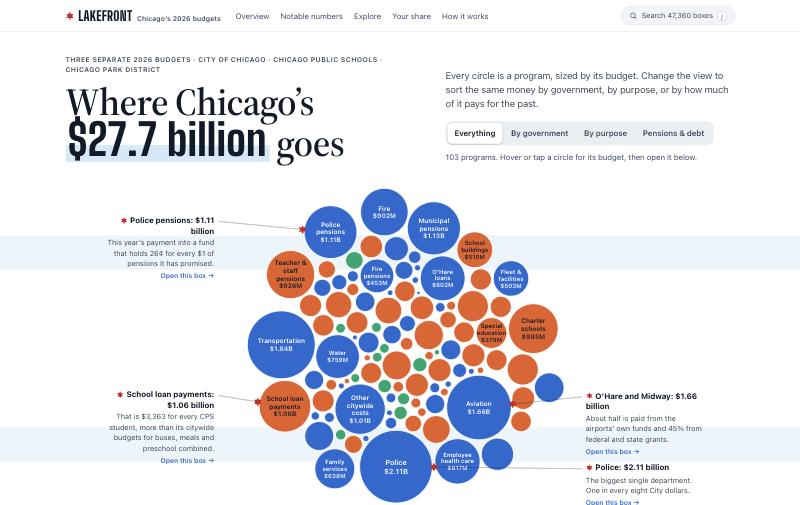
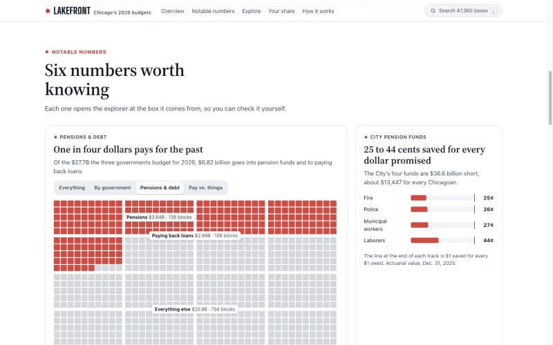
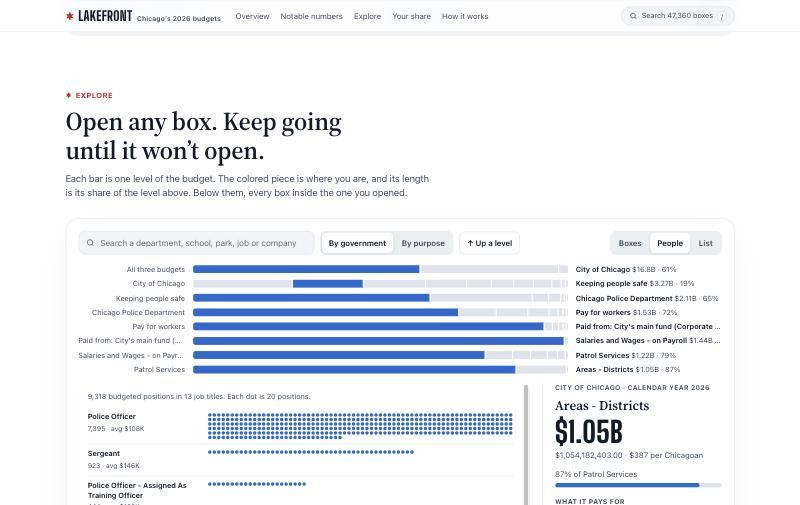
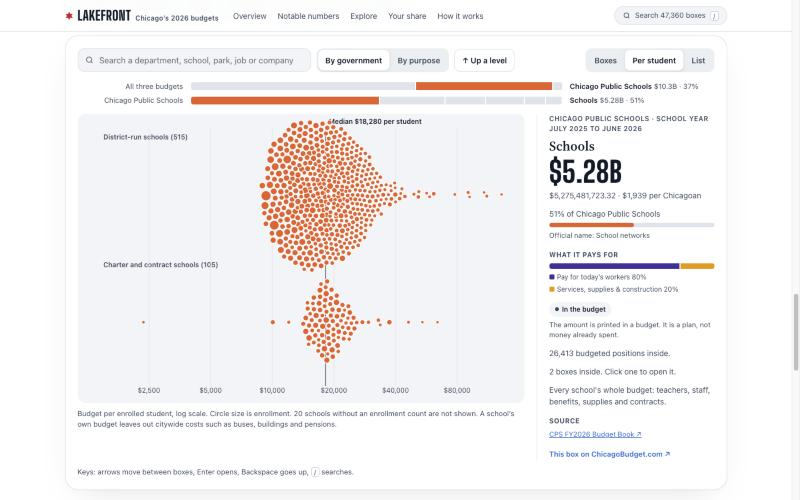
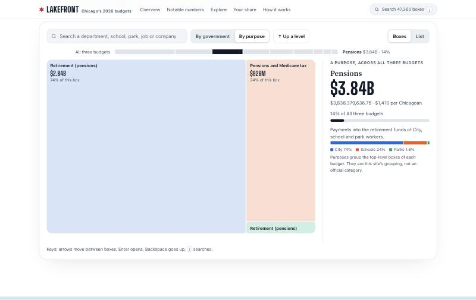

# Lakefront

A visual-first, one-page explorer for the 2026 budgets, built entirely from this repository's published site data (`data/public/2026/site/`). It adds no data and does not change the builders or the Astro site in `site/`.

Preview: https://lakefront-production-3bac.up.railway.app (built from this folder).



## What's on the page

- **Overview.** The 103 largest programs as circles, sized by budget. Four views regroup the same circles: everything, by government, by purpose, and pensions and debt. Four starred callouts open their boxes, and a table view lists every circle.
- **Notable numbers.** Six cards: the 1,000-block grid ("one in four dollars pays for the past"), pension funding, police, per-student spending, the City's biggest payees, and money counted twice. Each card opens the explorer at its box.
- **Explorer.** All 47,360 boxes, nine levels deep:
  - level bars show where you are and each piece's share of its level
  - a zooming treemap shows what's inside
  - a "by government / by purpose" toggle
  - views chosen by what's inside: per student for schools, per park, people for job titles, and a list
  - search across every box, including department context ("overtime fire")
  - a detail rail with the basis label, the "why it stops" sentence, side facts and sources
  - keyboard navigation and deep links (`#box=<id>&by=purpose&view=swarm`)
- **Your share.** Per resident or household, a live dollars-per-second meter, and the property tax split.
- **/methods.** Labels, money counted twice (to the cent), coverage, the largest dead ends, how this site groups money, privacy, glossary, sources and the City of Chicago data notice.

|  |  |
|---|---|
|  |  |

## Run it

Node 18 or newer and Python 3.

```sh
cd lakefront
npm ci
npm run data      # data/public/2026/site → lakefront/public/data
npm test          # financial attribution and fetch retry regressions
npm run dev       # http://127.0.0.1:5179
npm run build     # static site in dist/
```

`scripts/build-data.py` reads the committed site data (or a local `site/public/data` export, or `CB_EXPORT`). It writes three things to `public/data/` (gitignored):

| File | Contents | Size (brotli) |
|---|---|---|
| `core.json` | The first screen | about 50 KB |
| `tree.json` | All boxes as a compact skeleton, loaded after first paint | about 440 KB |
| `details/` | Per-box notes, side facts and sources, loaded on demand | varies |

Every figure in the page copy, title and preview text is generated from that data.

## Groupings made here

Two groupings are classifications of existing boxes, not official categories. `build-data.py` asserts that both still sum to each government's official total.

- **Purposes.** Each top-level box is assigned to one of nine purposes. CPS's pension box is split into pensions and employee health care.
- **What the money pays for.** Every final box is classed as one of three:
  - pay and benefits for today's workers
  - services, supplies and construction
  - pensions and debt (the pension and loan payments at the top of each budget)

  The class comes from the budgets' own spending-type boxes, with a keyword rule where there are none.

If these are useful, they could move into `build/export_site.py` next to the other checks.

## Deploy

`npm run build` produces a static `dist/`. A post-build step precompresses text files (brotli and gzip) and adds a `Dockerfile` and `Caddyfile` with strict security headers. That container is how the preview runs. Any static host works, including Cloudflare Pages like the main site. Set `SITE_URL` at build time to emit canonical and absolute preview-image URLs. Add `?still` to any page to render final states without animation.

Data: ChicagoBudget.com, CC BY 4.0. City of Chicago data is used under the City's notice, reproduced on the methods page.
